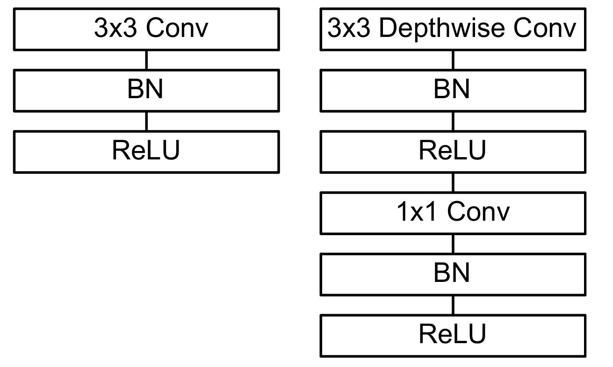
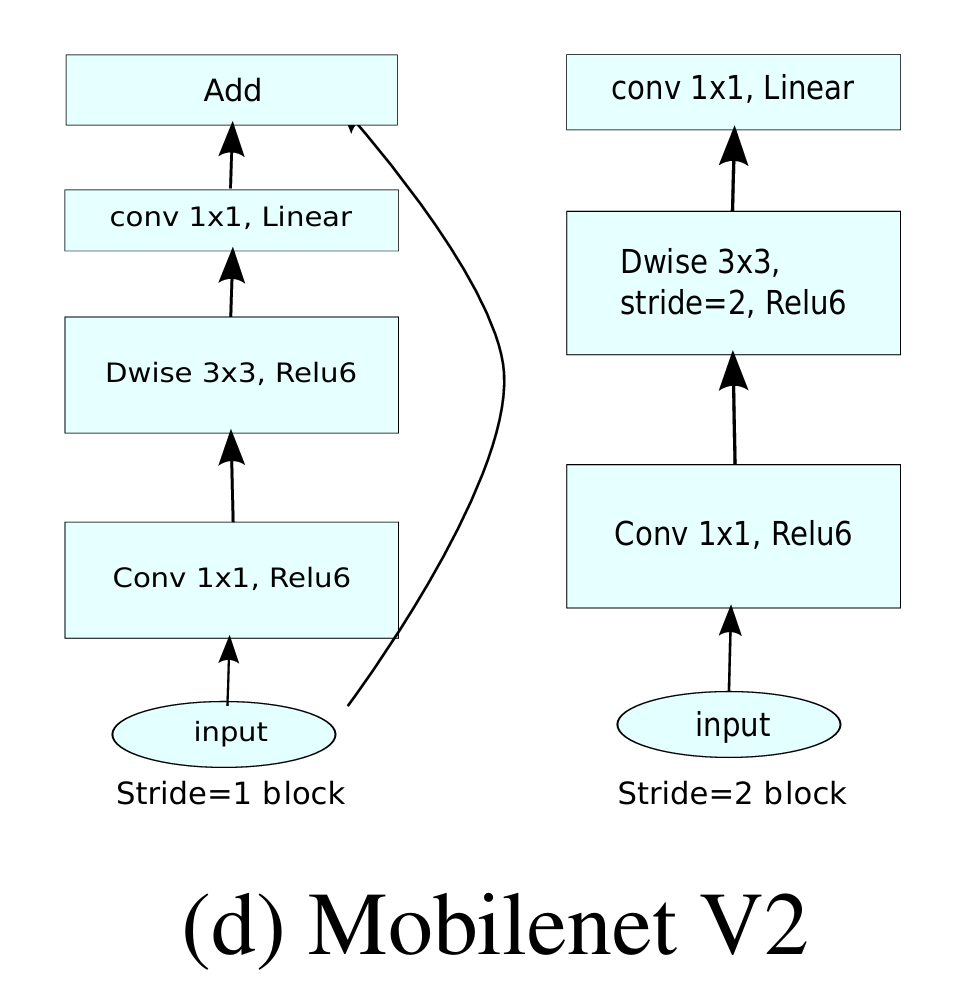

## Instruction

### 1. Reference
- PFLD: A Practical Facial Landmark Detector
  论文：[PFLD](https://arxiv.org/pdf/1902.10859)
- PFLD + GhostNet
  blog: [PFLD_GhostNet](https://blog.csdn.net/u010892804/article/details/108509243?fromshare=blogdetail&sharetype=blogdetail&sharerId=108509243&sharerefer=PC&sharesource=Zerotim&sharefrom=from_link)
- PFLD + GhostNet + MobileOne
  blog: [PFLD_GhostOne](https://blog.csdn.net/u010892804/article/details/127264664?fromshare=blogdetail&sharetype=blogdetail&sharerId=127264664&sharerefer=PC&sharesource=Zerotim&sharefrom=from_link)
- Depthwise Separable Convolution
  blog: [DSC](https://huahuaboy.blog.csdn.net/article/details/134174749?fromshare=blogdetail&sharetype=blogdetail&sharerId=134174749&sharerefer=PC&sharesource=Zerotim&sharefrom=from_link)
- GhostNet
  论文：[GhostNet](https://arxiv.org/pdf/1911.11907) 
  github: [Efficient-AI-Backbones
](https://github.com/huawei-noah/Efficient-AI-Backbones.git)
- MobileNet
  论文：v1: [MobileNet](https://arxiv.org/pdf/1704.04861)（**引入DSC**） | v2: [MobileNet-v2](https://arxiv.org/pdf/1801.04381) | v3: [MobileNet-v3](https://arxiv.org/pdf/1905.02244) 
- MobileOne
  论文：[MobileOne](https://arxiv.org/pdf/2206.04040) 
  github: [MobileOne](https://github.com/apple/ml-mobileone.git)

### 2. 核心文件与文件夹功能解析

建议在阅读代码时，按照以下模块划分来理解：

#### 2.1 根目录核心脚本
| 文件 | 用途 | 备注 |
| :--- | :--- | :--- |
| `config.py` | **全局配置** | 定义了超参数（学习率、Batch Size）、文件路径等。**改各种参数先看这里。** |
| `train.py` | **训练脚本** | 模型的训练入口，包含训练循环、梯度反向传播等逻辑。 |
| `test.py` | **测试脚本** | 用于在测试集上评估模型精度，计算 NME (Normalized Mean Error)。 |
| `pytorch2onnx.py` | **模型转换** | 将 PyTorch 模型 (`.pth`) 转换为通用的 ONNX 格式，这是落地部署的关键步骤。 |
| `onnx_inference.py` | **推理演示** | 加载转换后的 ONNX 模型进行推理，模拟真实落地场景。 |
| `requirement.txt` | **环境依赖** | Python 库依赖列表。 |

#### 2.2 核心模块 (`models/`)
这是你需要重点阅读的部分，特别是为了理解“轻量化”是怎么做到的。
*   `base_module.py`: 定义了基础积木，如 `MobileOneBlock` 和 `GhostOneBottleneck`。这些是构建轻量级网络的原子单元。
*   `PFLD_GhostOne.py`: 整个网络的架构定义。你会看到它如何组合上述积木。

#### 2.3 数据处理 (`dataset/` & `data/`)
*   `dataset/datasets.py`: 定义了 PyTorch 的 `Dataset` 类。包含数据增强逻辑（旋转、加噪、翻转），这对训练鲁棒的模型至关重要。
*   `data/SetPreparation.py`: 数据预处理脚本，用于将原始下载的数据集（WFLW）转换为训练需要的格式。

### 3. Archi_mini

1. **MobileNet**：核心是深度可分离卷积（Depthwise Separable Convolution, DSC），将标准卷积分解为深度卷积和逐点卷积，大幅减少计算量和参数量。
   - 深度卷积：**空间特征提取**，卷积核每一层和输入张量每一层一一对应，不改变通道数，无通道间交流
   - 逐点卷积：**通道特征融合**，使用1x1卷积核，融合各通道信息，实现升维或降维
   - 标准卷积计算量：$D_K \times D_K \times M \times N \times D_F \times D_F$，深度卷积计算量：$D_K \times D_K \times M \times D_F \times D_F$，逐点卷积计算量：$1 \times 1 \times M \times N \times D_F \times D_F$，总计算量大幅降低：$$\frac{D_K \times D_K \times M \times D_F \times D_F + 1 \times 1 \times M \times N \times D_F \times D_F}{D_K \times D_K \times M \times N \times D_F \times D_F} = \frac{1}{N} + \frac{1}{D_K^2}$$
   - 结构单元：DSC模块，包含深度卷积和逐点卷积两部分 
2. **MobileNet v2的 Inverted Residual 结构**
   ```
   输入（低维）
   ↓ 1×1 Conv（扩展）
   高维（t × C）
   ↓ 3×3 Depthwise Conv
   高维
   ↓ 1×1 Conv（线性压缩）
   输出（低维）
   
   低维 → 扩展 → 高维 → 压缩 → 低维
   └──────────────────────────┘
   ```
   先升维（通过 $1 \times 1 $ Conv）到高维空间，提升表达能力，然后做 **DWConv** 提取空间特征（DWConv即便在高通道数情况下也很便宜），最后再压缩（通过 $1 \times 1$ Conv）回低维空间，减少信息损失。注意，这里的$1 \times 1$ **Conv是 Pointwise Conv**
   
3. **GhostNet**：通过**线性变换生成更多特征图**，减少冗余计算，提高效率
   - 生成特征图：使用少量的“主”卷积核生成一部分**特征图**，然后通过廉价的线性变换（如**深度卷积**）生成更多“幽灵”特征图
   - 例如我们要生成通道数为256的特征图，我们可以先用**标准卷积**生成通道数为128的特征图，然后用**线性变换**生成另外128个
   - 结构单元：Ghost Module，包含主卷积和线性变换两部分。在此基础上构建了 Ghost Bottleneck 模块 
   - **Stride = 1 bottleneck结构**：直接将 MobileNet v2 中的 Inverted Residual 结构中的**两个 $1 \times 1$ Conv 替换为 Ghost Module，大幅降低计算量。** 
   - **Stride = 2 bottleneck结构**：需要把特征图的长宽减半时（比如$224 \rightarrow 112$），用这个模块，主路上的 DWConv Stride = 2 做下采样，shortcut 路径上也要用一个 Stride = 2 的DWConv 
4. **PFLD**：多任务辅助训练
   - Backbone（主干网络）：采用轻量级网络例如MobileNet v2，作用是提取**人脸特征**。这里还会做一个修改就是并不只利用最后一层的 feature map，而会把中间层级的 feature map 抽出来然后做 concat。作为**回归网络**直接输出人脸关键点的坐标$(x,y)$。
   - Auxiliary Network（辅助网络）：**只参与训练，不参与推理**。预测人脸的3D Pose：（偏航角Yaw，俯仰角Pitch，滚转角Roll）。工作原理：
   > 通常从 Backbone 的中间层（比如第 4 个 Block）引出一个分支，经过 **几个卷积层和全连接层，最后输出 3 个数值（代表三个角度）**
   - Loss函数设计与配合机制：$$\mathcal{L} = \sum_i w(\text{pose}) \cdot | \hat{y}_i - y_i |^2$$ **大姿态角的人脸 → 权重更大**，强迫模型去优化大姿态角情况下的检测效果。
5. **MobileOne：** 结构重参数化（Structural Re-parameterization）
   - 训练时可能有多分支结构，例如多个卷积核并行，提升表达能力（$3\times 3$ Conv, $1\times 1$ Conv, Identity）
   - 推理时将这些分支融合为单一卷积核，**减少内存访问成本**，提高边缘运行速度。
   - **训练时不可以直接合并，原因同 Residual 结构**

### 4. Task to do
1. 补全理论，阅读并理解上述架构的原始论文
2. 熟悉两个项目中的核心代码，以及工程结构。
3. 更远：Fine-Tune，训练自己的网络，完成训练、ONNX 导出、推理的全流程测试。
   > RTX 5090 32GB CPU:25 cores，Xeon(R) Platinum 8470Q 90 GB 仅需$3 \sim 6 h$即可完成训练

### 4. About this project

#### 4.1 单人脸检测

这个 PFLD_GhostOne 模型本身 根本无法 回归多张人脸。它一次只能处理一张人脸。

在实际工程应用中（以及你看到的很多演示视频里），处理多人脸图片是分 两步走（Two-Stage） 的：
- 第一步：人脸检测 (Face Detection)
  使用另一个模型（如 RetinaFace, SCRFD, MTCNN）。
  这个检测模型的任务是：**扫描整张大图，找出所有人的位置，画出 N 个 Bounding Box (检测框)。**
  PFLD 模型通常不负责这一步。
  
- 第二步：关键点回归 (Landmark Regression - PFLD 的工作)
  程序会根据第 1 步得到的 N 个框，**把这 N 张人脸分别裁剪（Crop）下来。**
  把这些裁剪下来的人脸，**统一缩放到 112x112。**
  然后**调用 PFLD 模型 N 次**。
  最后把 PFLD 预测出的相对坐标，还原回原图的绝对坐标。

这个项目的数据增强处理脚本`SetPreparation.py`，以及训练脚本`train.py`和测试脚本`test.py`，都是基于单人脸图像设计的。

#### 4.2 关于 .pth 文件

`.pth` 文件是 PyTorch 用于保存模型参数或完整模型的标准文件格式。它本质上是一个序列化（Pickled）的 Python 字典或其他对象。

**常见内容：**
通常，一个健壮的 `.pth` Checkpoint（检查点）文件不仅包含模型权重，还会包含恢复训练所需的其他元数据。
```python
checkpoint = {
    'epoch': 100,                          # 当前训练轮数
    'state_dict': model.state_dict(),      # 模型的所有权重参数 (Key-Value 字典)
    'optimizer': optimizer.state_dict(),   # 优化器的状态 (包含 Momentum, weight_decay 等历史信息)
    'best_nme': 0.05,                      # 当前最佳精度，防止覆盖
    'config': cfg                          # 甚至可以把 config 保存进去，方便复现
}
```

**保存与加载代码模板：**

1.  **保存 (Save):**
    ```python
    def save_checkpoint(model, optimizer, epoch, filename="checkpoint.pth"):
        checkpoint = {
            'epoch': epoch,
            'state_dict': model.state_dict(), # 推荐只保存 state_dict 而不是整个 model 对象
            'optimizer': optimizer.state_dict()
        }
        torch.save(checkpoint, filename)
    ```

2.  **加载 (Load for Inference - 推理):**
    ```python
    # 加载已训练好的权重进行预测
    checkpoint = torch.load("checkpoint.pth", map_location='cpu') # 注意 map_location
    
    # 兼容性处理：有时候保存的是字典，有时候直接是 state_dict
    if 'state_dict' in checkpoint:
        model.load_state_dict(checkpoint['state_dict'])
    else:
        model.load_state_dict(checkpoint)
        
    model.eval() # 别忘了切换模式！
    ```

3.  **加载 (Load for Resume - 恢复训练):**
    ```python
    checkpoint = torch.load("checkpoint.pth")
    model.load_state_dict(checkpoint['state_dict'])
    optimizer.load_state_dict(checkpoint['optimizer']) # 恢复优化器状态至关重要
    start_epoch = checkpoint['epoch'] + 1
    ```
